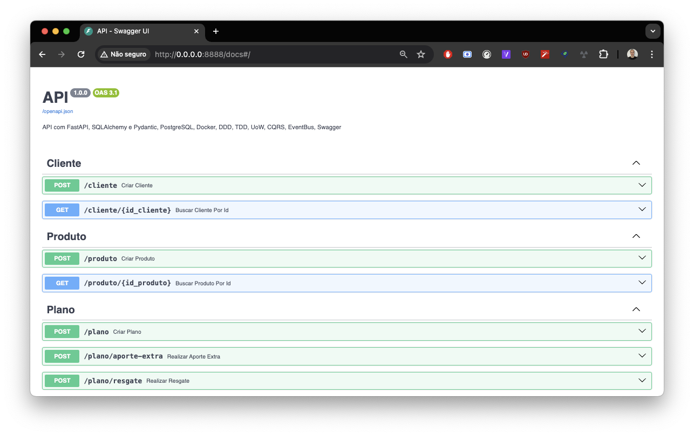
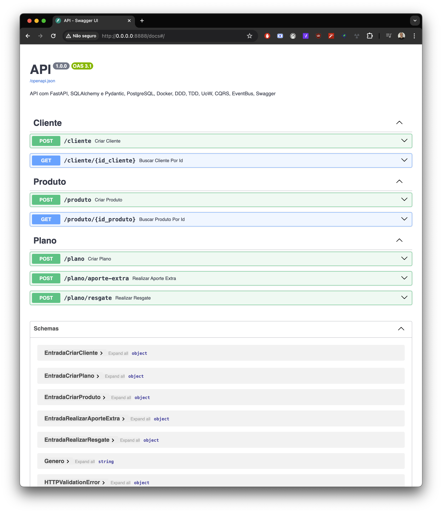
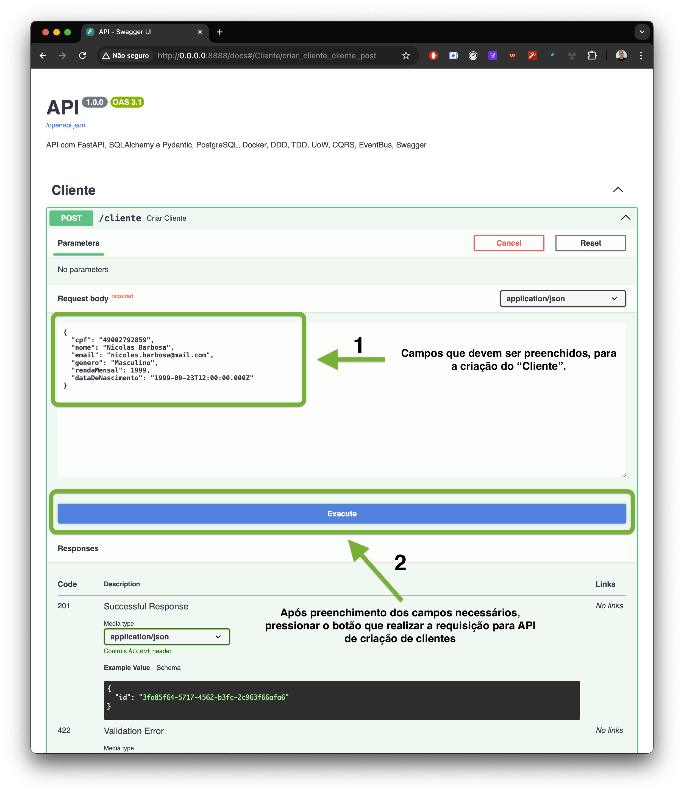
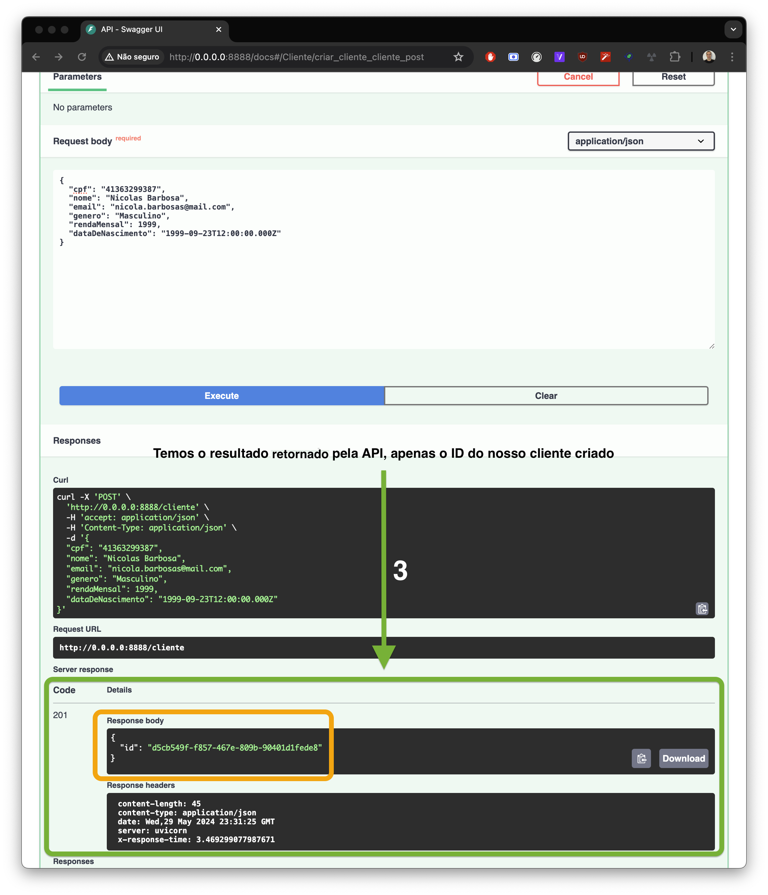
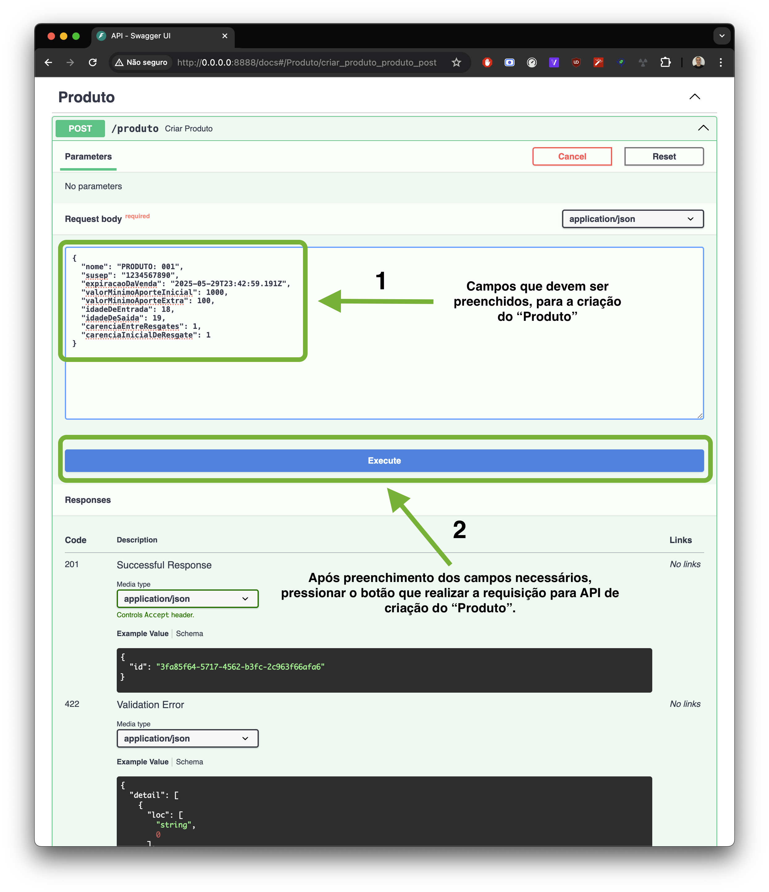
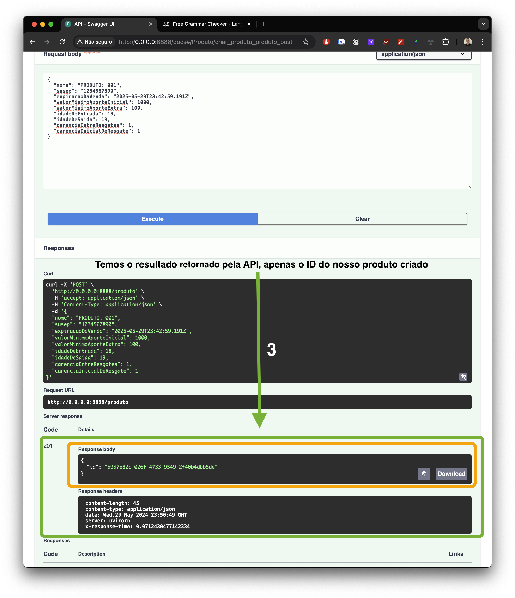
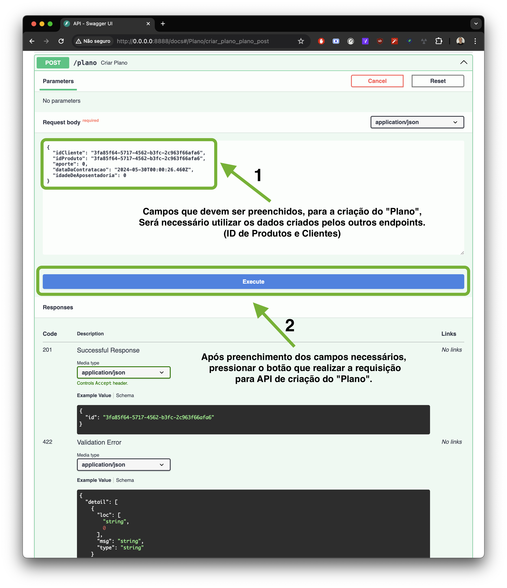
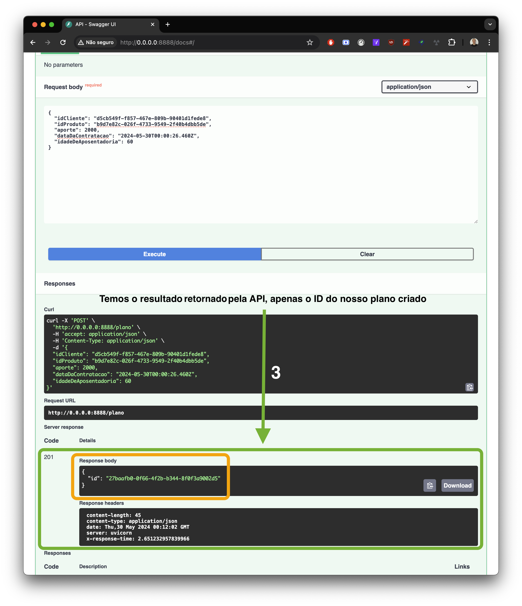
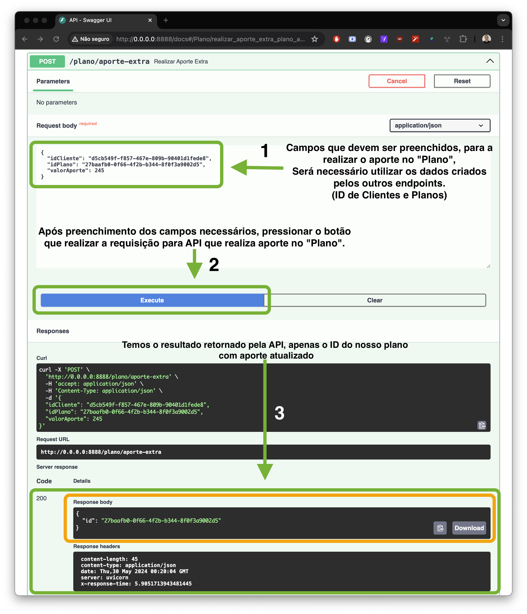
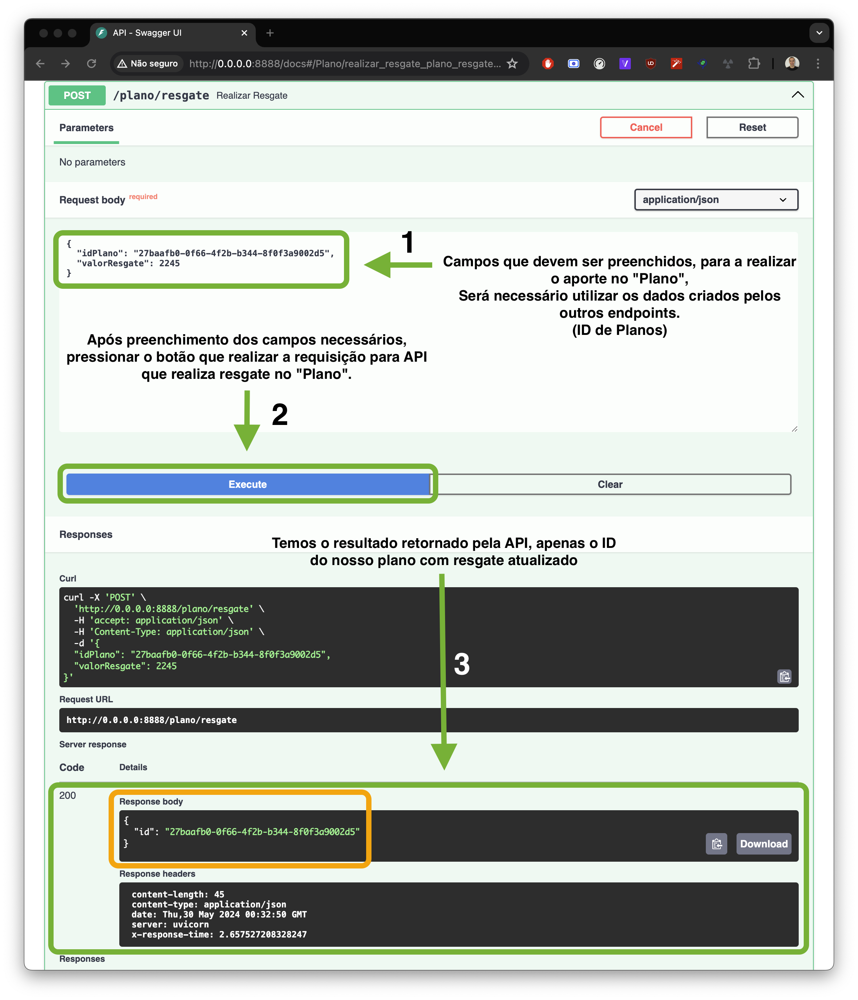

- ---

## :computer: Como Executar o Projeto:
- Certifique-se de que não há nenhum serviço rodando na porta **8888** e **5432**, o serviço do **Postgres** e **Backend** serão executados em containers Docker.

- ---
1 - Entre na pasta do projeto e execute o comando:
```bash 
make docker-up
```
> Após a execução do comando acima, o projeto estará rodando na porta 8888. (Configurado no .env/.env.docker)

2 - Rodando as Migrations:
```bash 
make migration-upgrade
```
> Após a execução do comando acima, as tabelas serão criadas no banco de dados.

3 - Acesse o projeto em seu navegador:
```bash
http://localhost:8888
```
> Deve lhe redirecionar para a página de Documentação da API.


---

## :test_tube: Testes dos Endpoints:

1 - Acesse a documentação da API:


> Aqui você pode testar os endpoints da API pelo próprio Swagger. Está disponível para testes os endpoints de **Clientes**, **Produtos** e **Planos**.

---

2 - Navegue até o endpoint de ***Clientes*** e clique em **Try it out**:


- Insira os dados do cliente e clique em **Execute**.


- O cliente será cadastrado e você receberá um **Response Code 201** com o **ID** do cliente.

---

3 - Navegue até o endpoint de ***Produtos*** e clique em **Try it out**:


- Insira os dados do produto e clique em **Execute**.


- O produto será cadastrado e você receberá um **Response Code 201** com o **ID** do produto.

---

4 - Navegue até o endpoint de ***Planos*** e clique em **Try it out**:


- Insira os dados do plano e clique em **Execute**.


- O plano será cadastrado e você receberá um **Response Code 201** com o **ID** do plano.

---
 
5 - Navegue até o endpoint de ***Plano -> Aporte Extra*** e clique em **Try it out**:


- Insira os dados do aporte extra e clique em **Execute**.
- O aporte extra será cadastrado e você receberá um **Response Code 200** com o **ID** do aporte extra.

---

6 - Navegue até o endpoint de ***Plano -> Resgate*** e clique em **Try it out**:


- O aporte extra será cadastrado e você receberá um **Response Code 200** com o **ID** do resgate.

---

7 - Veja o vídeo com os passos acima:
https://github.com/niko-labs/backend-brprev/assets/59735468/eaa8c70d-af50-4536-a1ac-dbd4ddecf829
<center>
<video width="480" height="360" controls>
  <source src="./docs/steps/testes-endpoints-01.mp4" type="video/mp4">
</video>
</center>

----
> 
----
## Rodando o projeto localmente:
> Certifique-se de que o **Python 3.11** e o **Poetry** estão instalados em sua máquina.

1 - Entre na pasta do projeto e execute o comando:
```bash
pip install poetry
```

2 - Instale as dependências do projeto:
```bash
poetry install
```

3 - Inicialize o banco de dados:
```bash
make docker-db-up
```
> Após a execução do comando acima, o banco de dados estará rodando na porta 5432.


- Para encerrar o banco de dados, execute o comando:
```bash
make docker-db-down
```

4 - Execute as migrações:
```bash
make migration-upgrade
```

5 - Execute o comando para rodar o projeto:
> Recomendado utilizar o VSCode para rodar o projeto. (O mesmo já está configurado para rodar o projeto)

5.1 - Caso queira rodar o projeto via terminal, execute o comando:
```bash
poetry run uvicorn servidor.config:app
```


- ---
## :wrench: Comandos Úteis
- Caso queira parar o projeto, execute o comando:
```bash
make docker-down
```

- Caso queira rodar os testes, execute o comando:
```bash
make run-tests
```
